# Freeware Document Management System
OpenKM Community Edition is an [Freeware Document Management System](https://www.openkm.com/en/open-source-document-management-system.html). If you are looking for a free cost then "Community" is your best option. OpenKM [document management system (DMS)](https://www.openkm.com/en/document-management.html) allows businesses to control the production, storage, management and distribution of electronic documents, yielding greater effectiveness and the ability to reuse information and to control the flow of the documents.

OpenKM integrates all essential documents management, collaboration and an advanced search functionality into one easy to use solution. The system also includes administration tools to define the roles of various users, access control, user quota, level of document security, detailed logs of activity and automations setup.

OpenKM builds a highly valuable repository of corporate information assets to facilitate [knowledge](https://www.openkm.com/en/knowledge-management-system.html) creation and improve business decision making, boosting workgroups and enterprise productivity through shared practices, greater, better customer relations, faster sales cycles, improved product time-to-market, and better-informed decision making.

With OpenKM Freeware Community Edition you can:
* Collect information from any digital source.
* Collaborate with colleagues on documents and projects.
* Empower organizations to capitalize on accumulated knowledge by locating documents, experts, and information sources.
* Embedded workflow engine to take control of your business case.
* Automate tasks.

## License Change Starting from Version 7.0

Starting with version 7.0, OpenKM Community Edition changes its licensing model. This version will no longer include source code and will be distributed in binary format only, free of charge.

### Why this change?

OpenKM has been an active project for over 15 years, with a dedicated team focused on development, maintenance, and support. During this time, we have witnessed a recurring and growing problem: third parties taking the source code of the Community Edition, redistributing it as their own product, or using it as the foundation for commercial services without any contribution to the project or respect for the work of those who make it possible.

This kind of use is not only ethically questionable, but it also threatens the long-term viability of the project. A software project of this scale requires real resources: time, infrastructure, specialized knowledge, and dedicated people. Without a sustainable model, there is no project.

### What changes exactly?

Starting with version 7.0, OpenKM CE will be distributed as a free binary without access to the source code. The application will remain freely downloadable and usable at no cost for individuals, companies, and organizations using it to manage their own documentation.

### What does NOT change?

Versions prior to 7.0 retain their original license and their source code will remain available in this repository. Nothing changes for those already working with those versions.

### A note to our community

We are aware that this change may spark debate, and we understand that. The open source philosophy holds enormous value, and we ourselves are both beneficiaries and advocates of that ecosystem. However, open source does not mean an absence of boundaries when it comes to those who act in bad faith.

We are taking this step to protect the project and ensure that OpenKM continues to evolve, improve, and remain available to everyone for many years to come. If you value OpenKM and want to support its development, please consider the Professional Edition, which offers advanced features and official support.

Thank you for being part of this journey.

*The OpenKM Team*

## Installing binaries
You can install OpenKM binaries from [SourceForge](https://sourceforge.net/projects/openkm/):
* **OKMInstaller.jar**: The OpenKM installer assistant. Usage information at [using the installer](https://docs.openkm.com/kcenter/view/okm-7.0/using-the-installer.html).
* **OpenKM-${Version}.zip**: Which just contains the OpenKM.war application without Tomcat and configuration
  files needed to get it running.

## Installation wizard videos
### Linux
This video shows step by step the installation process of OpenKM Community version in Linux.

[](https://www.youtube.com/watch?v=WJrkD2BdAJo "Community version installation in Linux")

[Spanish version](https://www.youtube.com/watch?v=2_CMEpHkwqA)

### Windows
This video shows step by step the installation process of OpenKM Community version in Windows.

[](https://www.youtube.com/watch?v=7C40UMajJ0k "Community installation process in Windows")

[Spanish version](https://www.youtube.com/watch?v=6F7Hany7BMc)

## Docker
[OpenKM official release of docker](https://hub.docker.com/r/openkm/openkm-ce)

## Building from Source
```sh
$ git clone [git-repo-url] openkm-community
$ cd openkm-community
$ mvn clean package
```

## Documentation
* [OpenKM Knowledge Center](https://docs.openkm.com/kcenter/view/okm-7.0/)
* [Hardware and software requirements](https://docs.openkm.com/kcenter/view/okm-7.0/hardware-and-software-requirements.html)
* [Installation](https://docs.openkm.com/kcenter/view/okm-7.0/installation.html)
* [Using the installer](https://docs.openkm.com/kcenter/view/okm-7.0/using-the-installer.html)
* [Troubleshooting](https://docs.openkm.com/kcenter/view/okm-7.0/troubleshooting.html)
* [Administration guide](https://docs.openkm.com/kcenter/view/okm-7.0/administration-guide.html)
* [User guide](https://docs.openkm.com/kcenter/view/okm-7.0/user-guide.html)
* [Migration guide](https://docs.openkm.com/kcenter/view/okm-7.0/migration-guide.html)
* [Development guide](https://docs.openkm.com/kcenter/view/okm-7.0/development.html)

## Reporting issues
OpenKM Freeware Community Edition is supported by developers and technical enthusiasts via [the forum](http://forum.openkm.com) of the user community. If you want to raise an issue, please follow the below recommendations:
* Before you post a question, please search the question to see if someone has already reported it / asked for it.
* If the question does not already exist, create a new post.
* Please provide as much detailed information as possible with the issue report. We need to know the version of OpenKM, Operating System, browser and whatever you think might help us to understand the problem or question.

## License
[OpenKM Document Management System Community Edition](https://www.openkm.com/en/open-source-document-management-system.html) is distributed free of charge in binary format.
Starting with version 7.0, the source code is no longer publicly available. Previous versions (up to 6.x) remain available under the [GNU General Public Licence version 2](https://www.gnu.org/licenses/gpl-2.0.html), and their source code will continue to be accessible in this repository.

## Screenshots

### File Upload
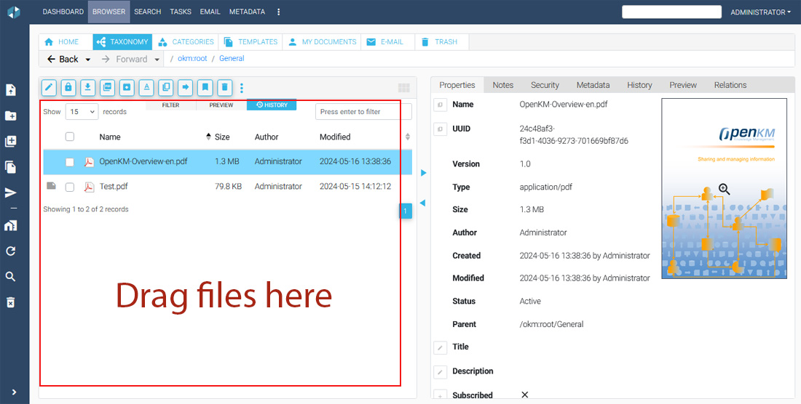

Document browser with drag & drop file upload support. The left panel lists the documents in the current folder while the right panel displays the selected document's properties, including name, UUID, version, size, author, and a thumbnail preview.

### Mobile Support (Android & iPhone)
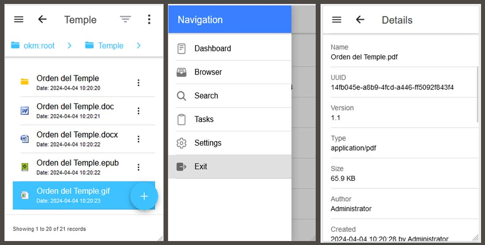

Native mobile experience on Android and iPhone. Shows the file browser, the navigation menu (Dashboard, Browser, Search, Tasks, Settings), and the document details panel — all optimised for small screens.

### Templates
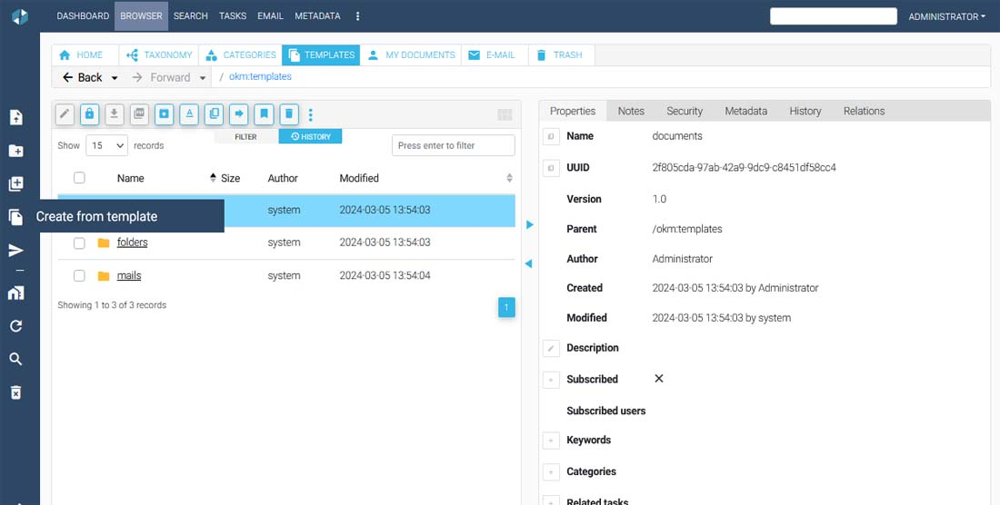

Template management section of the browser. Users can create new documents or folder structures from predefined templates stored under `okm:templates`, streamlining the creation of standardised content.

### Document Previewer
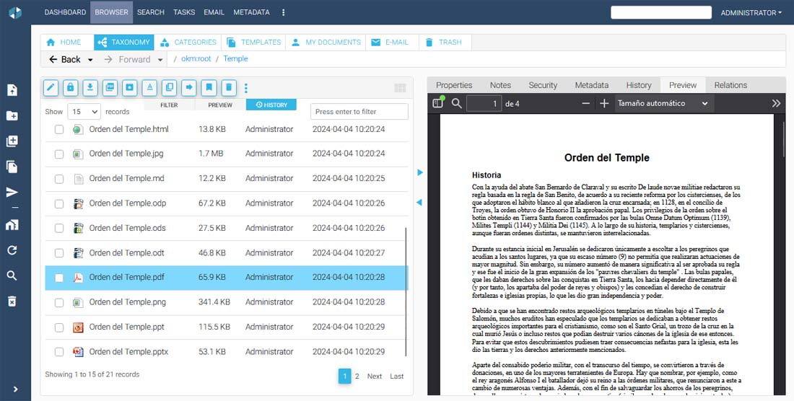

Inline document previewer rendering a PDF directly inside the browser without leaving the application. Supports multiple file formats so users can review content without downloading.

### Email Archiving
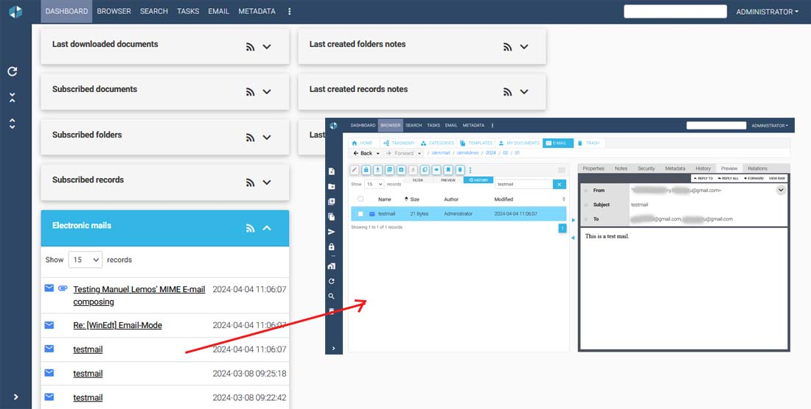

Email archiving feature showing the dashboard widget "Electronic mails" alongside the email browser. Emails are stored and browsable like any other document, with full header and body preview.

### Granular Access Control List
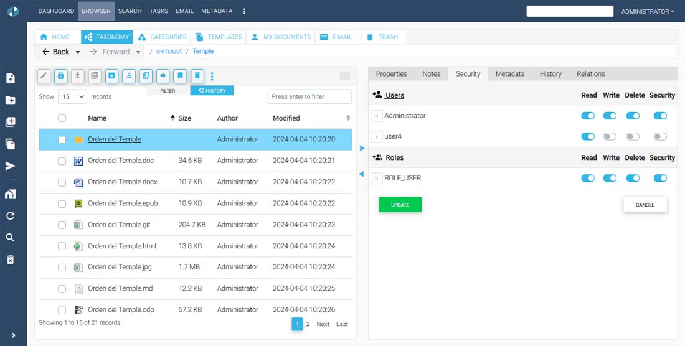

Per-node security configuration through the Security tab. Administrators can assign Read, Write, Delete, and Security permissions individually to specific users and roles using toggle switches.

### User Profiles
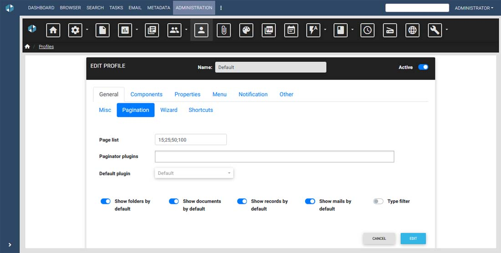

Administration panel for editing user profiles. Configurable options include pagination settings, visible components, menu items, notifications, shortcuts, and wizard behaviour — enabling fine-grained UI customisation per role.

### Search Engine
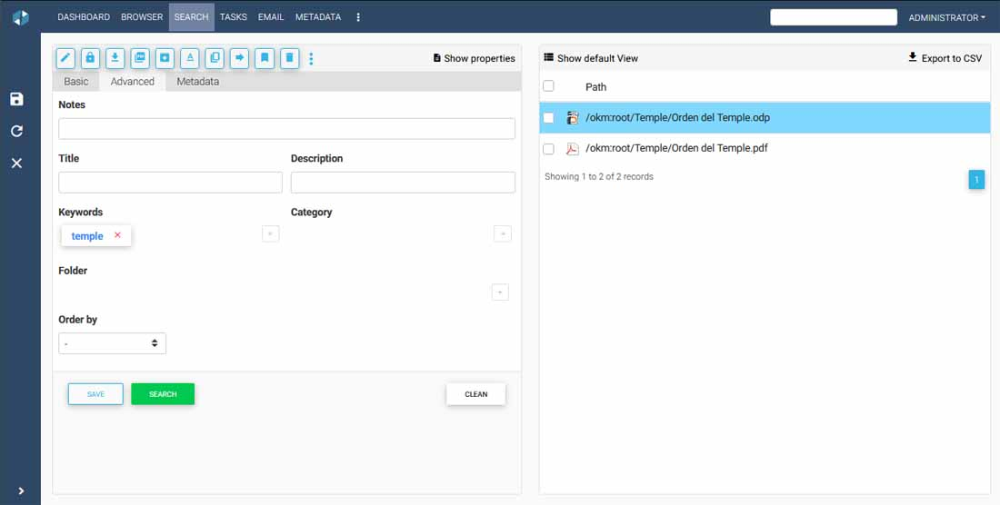

Powerful search interface with Basic, Advanced, and Metadata modes. Supports filtering by notes, title, description, keywords, category, and folder. Results are displayed instantly with direct path links and can be exported to CSV.

### Forum
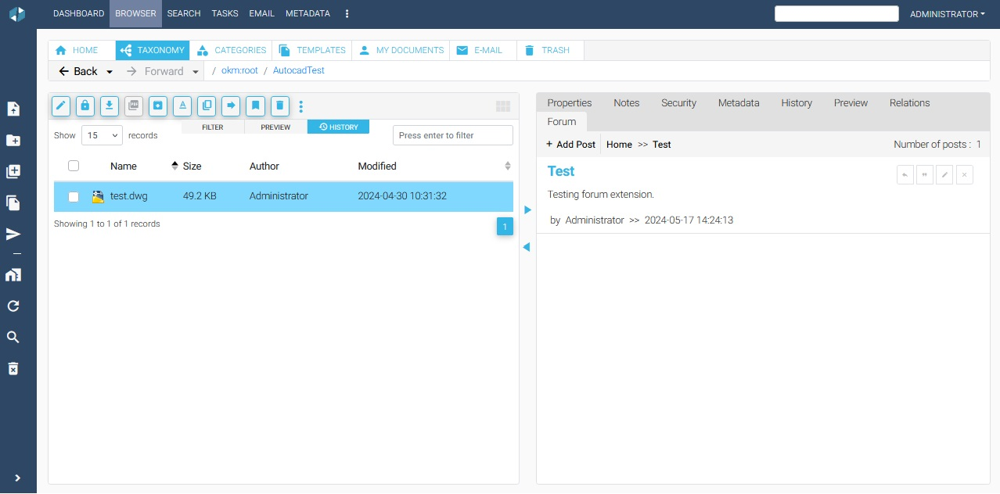

Threaded discussion forum attached directly to a document. Users can add posts and follow conversations contextualised to the document they are reviewing, keeping collaboration in one place.

### Forum Editor
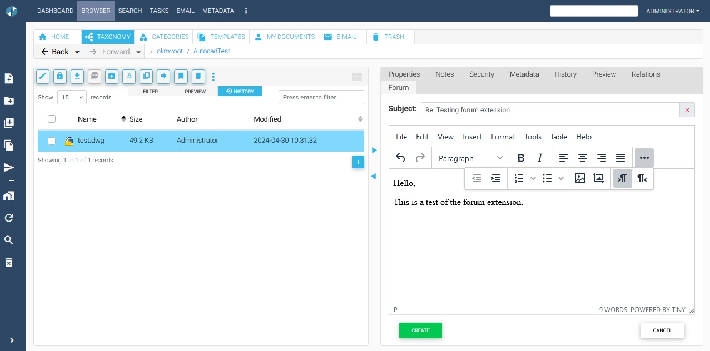

Rich text editor (powered by TinyMCE) for composing forum posts. Provides full formatting capabilities including bold, italic, lists, images, and tables for well-structured replies.

### Version Control
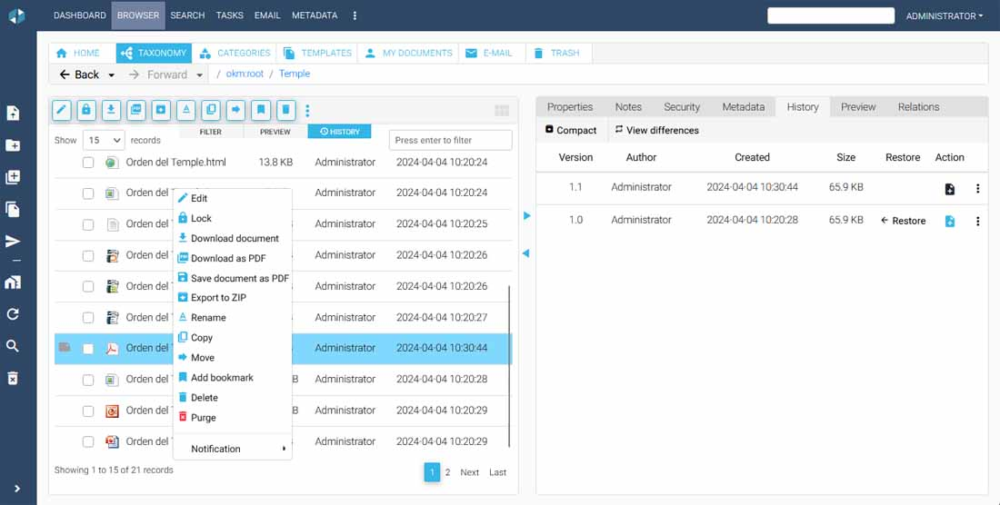

Document version history shown in the History tab. Lists all versions with author, creation date, and file size, with options to restore a previous version, compare differences, or download a specific revision.

### Subscriptions
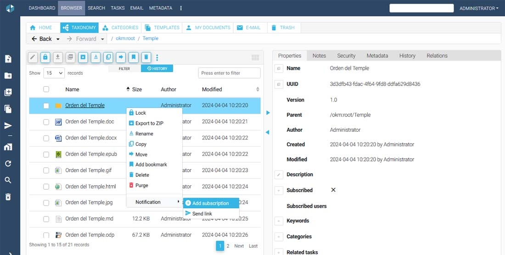

Subscription management via the context menu. Users can subscribe to any document or folder to receive automatic notifications whenever the content is modified.

### Keywords
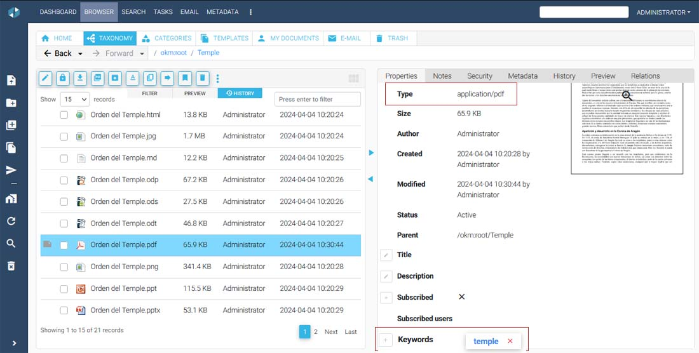

Keyword tagging shown in the document properties panel. Tags are displayed as chips and can be used as search criteria, making document classification and retrieval faster and more accurate.

### Notifications
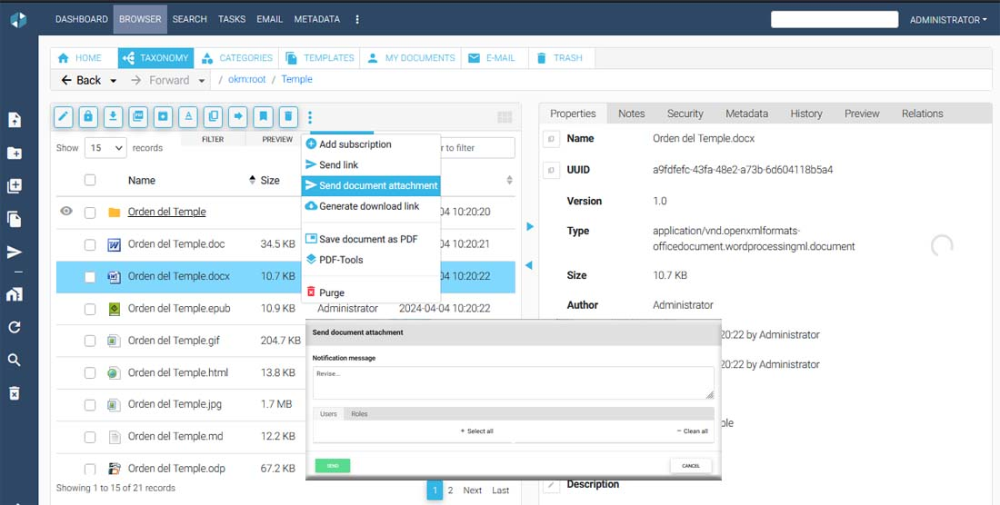

Document notification dialog allowing users to send the document as an email attachment with a custom message to selected users or roles directly from the browser.

### Notes
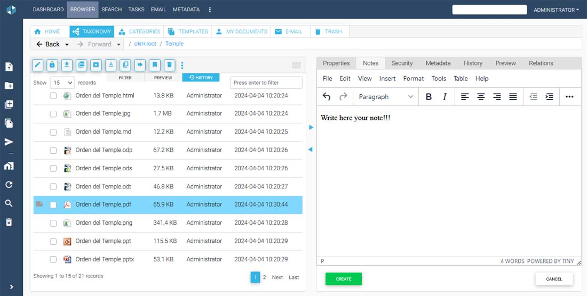

Rich text note editor (powered by TinyMCE) attached to any document or folder. Allows users to write formatted annotations, observations, or instructions alongside the document content.

### Lock and Unlock
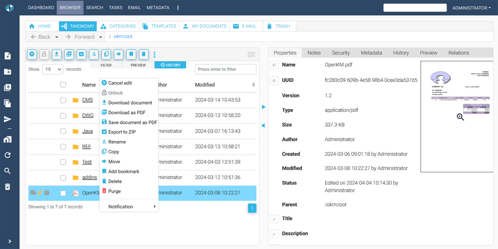

Document locking mechanism shown via the context menu. When a document is locked for editing, other users see the locked status and cannot modify it until it is explicitly unlocked or checked in.

### Personal Documents
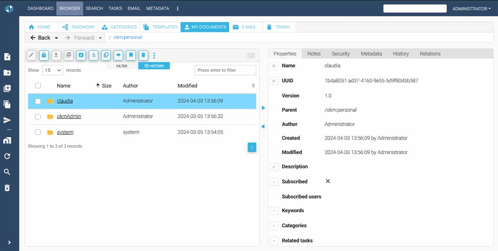

Personal document space (`okm:personal`) providing each user with a private folder isolated from the shared repository, visible only to the document owner and administrators.

### Trash per User
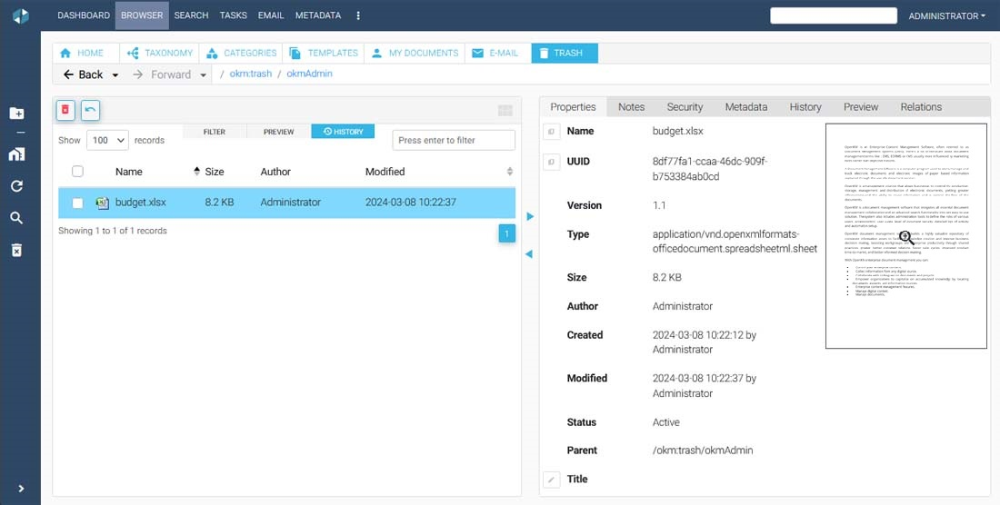

Per-user trash folder where deleted documents are held before permanent removal. Each user manages their own recycle bin independently, preventing accidental data loss.

### Document Relations
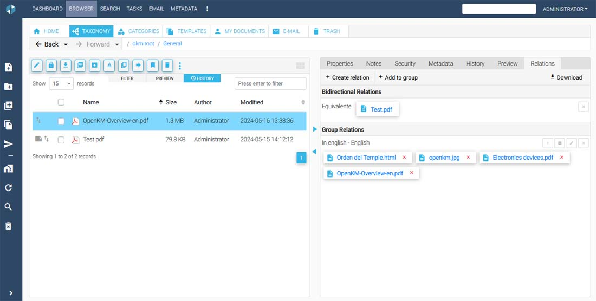

Relations tab showing both bidirectional links between equivalent documents and group relations (e.g. different language versions of the same content), enabling structured cross-referencing across the repository.

### Activity Log
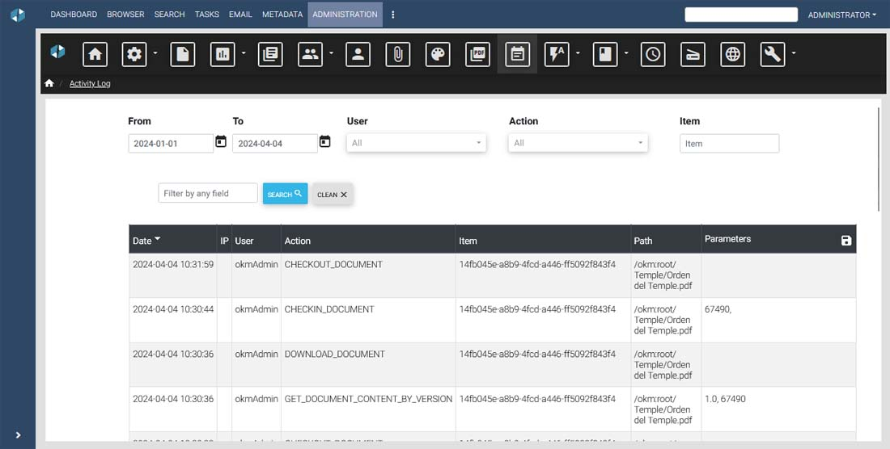

Full activity audit log in the Administration panel. Records every user action (checkout, checkin, download, etc.) with timestamp, IP address, user, affected item path, and operation parameters for complete traceability.
